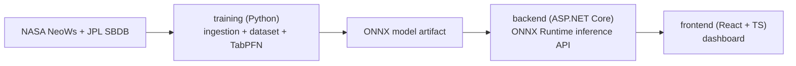

# AsteroidSafe
Web dashboard that ingests NASA NeoWs / JPL SBDB data and classifies Near-Earth Objects as Potentially Hazardous (PHA) using a pretrained tabular foundation model (TabPFN), deployed via ONNX Runtime in .NET.

---

## Tech stack
- Frontend: React + TypeScript (Vite)
- Backend: ASP.NET Core Web API
- ML: Python (TabPFN + baselines)
- Deployment: ONNX Runtime (.NET)

---

## Architecture
- `frontend/` — dashboard UI
- `backend/` — REST API + ONNX inference
- `training/` — data ingestion + training + export to ONNX
- `docs/` — documentation and reports
  

---

## Project management
- 📌 [Milestones](https://github.com/Avuii/AsteroidSafe/milestones)
- ✅ [Issues](https://github.com/Avuii/AsteroidSafe/issues)
- 🧭 [Project board](https://github.com/Avuii/AsteroidSafe/projects)

## Roadmap (Milestones)
- [M0 — Setup & Standards](./milestone/1)
- [M1 — Data Ingestion](./milestone/2)
- [M2 — Dataset & Feature Engineering](./milestone/3)
- [M3 — Model Training](./milestone/4)
- [M4 — ONNX + .NET Inference](./milestone/5)
- [M5 — Web Dashboard](./milestone/6)
- [M6 — Docs & Release](./milestone/7)

